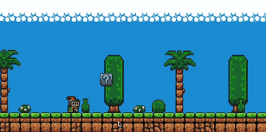
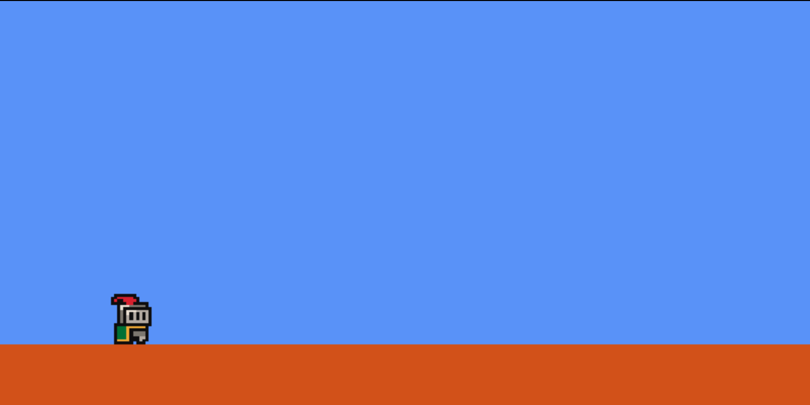
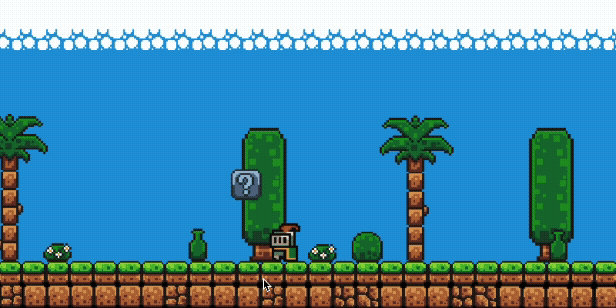
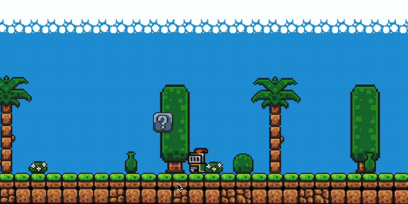
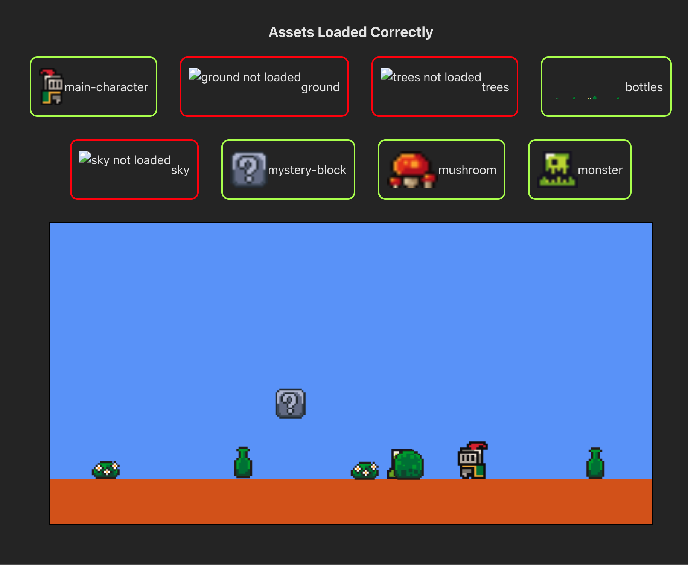

# Bienvenue à la compétition Web des CS Games 2025!

## Mise en contexte

Pour cette épreuve, vous aurez à compléter deux sections distinctes : le backend et le frontend.

Le but de cette épreuve est de concevoir un jeu rétro à l'intérieur de votre navigateur web. Voici un exemple du résultat attendu.

### Backend

La responsabilité du backend est de créer un ensemble de routes vous permettant d'avoir accès à l'ensemble des *assets* nécessaire à la création du jeu.

L'ensemble des fichiers est présent dans le dossier `/database`.

Voici l'ensemble de routes que vous devrez créer :

Routes pour les personnages :

- `GET /api/character/main-character`
- `GET /api/character/monster`

Routes pour les arrière-plans :
- `GET /api/background/sky`
- `GET /api/background/trees`
- `GET /api/background/ground`

Routes pour les paysages :
- `GET /api/scenery/bottles`
- `GET /api/scenery/mushroom`
- `GET /api/scenery/mystery-block`

Chacune de ces routes devrait retourner un PNG au serveur. Une route de base vous est fourni. N'hésitez pas à la modifier pour les besoins du challenge.

    À noter : Il est techniquement possible d'utiliser directement les images dans le frontend. Si tel est le cas, aucun point de sera donné pour le backend.

### Frontend

Initialement, lorsque vous ouvrez l'application, vous devriez pouvoir faire sauter le personnage principal. À ce stage, uniquement l'image du personnage principal devrait être fonctionnel.

Pour la suite, vous devrez implémenter un ensemble de mécanique de jeu.

Une grille de correction complète est disponible dans le fichier [CORRECTION.md](./CORRECTION.md).

Le frontend se divise en 4 sections : les personnages, les arrière-plans, les paysages et les fonctionnalités de gestion des assets. La section suivante décrira chaque fonctionnalités à implémenter.

#### Characters

Dans le cas du personnage principal, on souhaite pouvoir l'utiliser à partir des flèches ⬅️, ➡️, ⬆️. Lorsque le personnage se déplace vers la droite, l'image devrait pointer vers la droite, alors que lorsque le personnage se déplace vers la gauche, l'image devrait pointer vers la gauche. Voici un exemple.

Dans le cas de l'ennemie, celui-ci devrait se déplacer de droite à gauche. Lorsque le personnage touche à l'ennemie, celui-ci devrait disparaître.

#### Background

Cette section est assez simple, vous devez simplement utiliser les assets fournis par le serveur pour créer l'envrionnement immersif (voir grille de correction pour plus de détails).

#### Scenery

Lorsque le personnage entre en collision avec la boîte mystère, un champignon devrait appraître à quelque part (peu importe où tant que celui-ci appraît).

Lorsque le personnage entre en collision avec le champignon, celui-ci devrait disparaître.

#### Asset Management

Vous devez dans cette section créer des composants permettant à un utilisateur du jeu de voir quels sont les assets qui ont pu être téléchargé par le serveur et les assets qui n'ont pas pu l'être. (Voir grille de correction pour plus de détails [CORRECTION.md](./CORRECTION.md).)

Voici un exemple :

## Grille de correction

Une grille de correction complète est disponible dans le fichier [CORRECTION.md](./CORRECTION.md).

