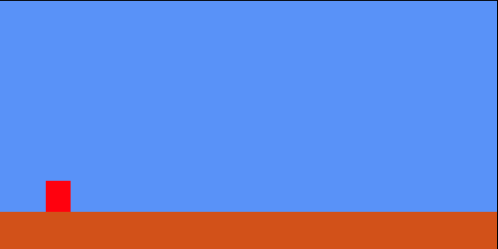

# Bienvenue à la compétition Web des CS Games 2025!

## Mise en contexte

Pour cette épreuve, vous aurez à compléter deux sections distinctes : le backend et le frontend.

Le but de cette épreuve est de concevoir un jeu rétro à l'intérieur de votre navigateur web. Voici un exemple du résultat attendu.

### Backend

La responsabilité du backend est de créer un ensemble de routes vous permettant d'avoir accès à l'ensemble des *assets* nécessaire à la création du jeu.

L'ensemble des fichiers est présent dans le dossier `/database`.

Voici l'ensemble de routes que vous devrez créer :

Routes pour les personnages :

- `GET /api/character/main-character`
- `GET /api/character/monster`

Routes pour les arrière-plans :
- `GET /api/background/sky`
- `GET /api/background/trees`
- `GET /api/background/ground`

Routes pour les paysages :
- `GET /api/scenery/bottles`
- `GET /api/scenery/mushroom`
- `GET /api/scenery/mystery-block`

Chacune de ces routes devrait retourner un PNG au serveur.

    À noter : Il est techniquement possible d'utiliser directement les images dans le frontend. Si tel est le cas, aucun point de sera donné pour le backend.

### Frontend

Initialement, lorsque vous ouvrez l'application, vous devriez pouvoir utiliser le personnage principal. À ce stage, aucune image ne devrait être téléchargé. Vous devriez aussi être capable de pouvoir utiliser faire sauter le personnage.

## Grille de correction

Une grille de correction complète est disponible dans le fichier [CORRECTION.md](./CORRECTION.md).

