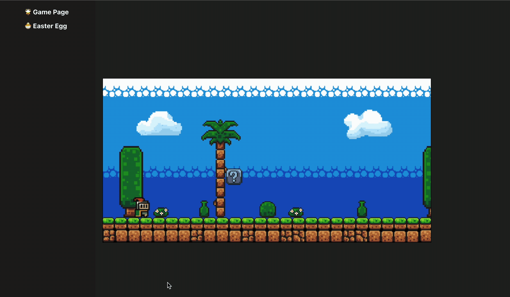
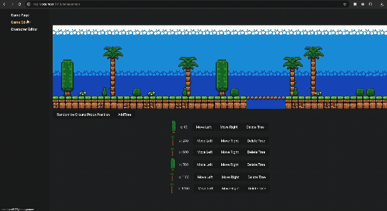
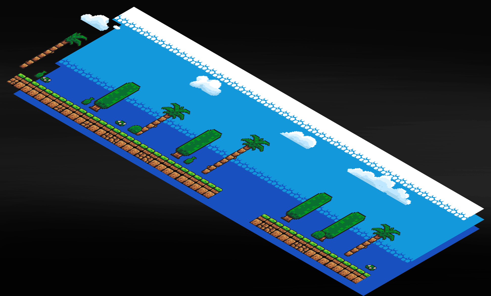
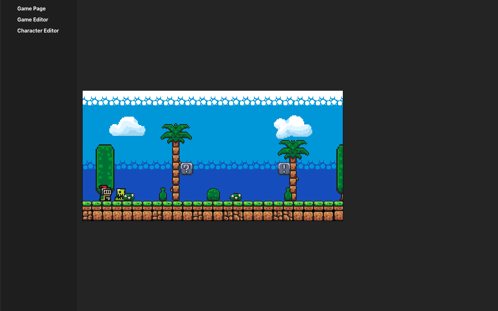
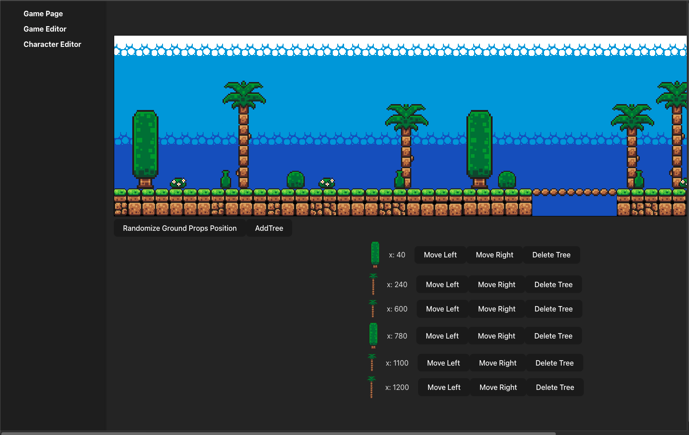
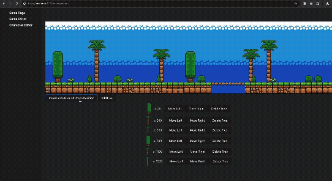

### Welcome to the CS Games 2025 Web Competition!
## Context

For this challenge, you must try to implement as many of the requirements as possible listed in the grading grid `Correction CSGames.xlsx`.

The goal of this challenge is to design a website that allows users to create and edit a 2D game directly in their web browser. Below is an example of the resulting game.

For this challenge, you are free to choose which requirements you wish to implement. The requirements are divided according to the different pages of the application.

The following sections provide detailed explanations of our expectations for each requirement. Please note that grading will be done exclusively based on the grading grid `Correction CSGames.xlsx`.

It is also worth noting that, to facilitate grading, you are encouraged to check off the requirements you have completed directly in the Excel file.

## Navigation Bar

To navigate through the application, you are required to implement a navigation bar. The navigation bar must be displayed as a panel on the left side of the application. For additional points, make the navigation bar collapsible.

## Game Page

As you can see from the base project, the game page is provided with a fully implemented game loop. From the file `Game/Game.tsx`, you will find an example of how rendering is handled.

To give you a better understanding of the game loop, you can think of it as an infinite loop. At each frame per second, user inputs are captured, processed, and then each item is rendered one by one. The order in which rendering occurs determines, in this 2D world, which images appear in the foreground and which appear in the background.

As you can see, in the base model, very few elements are present in the game.

To add a new item to the game, you are free to choose any approach you prefer. However, a basic example is provided to help you get started with the challenge.

Inside the grading grid, a detailed table is provided listing all the elements you can add: cloudy sky, pale blue sky, dark blue sky, clouds, trees, monsters, bushes, bottles, flowers, etc. Below is an example of the game once several elements have been added.

Example of the interface :

Example of the game in action :

As shown in the grading grid, several functionalities are also required. These functionalities will influence the behavior of the character, the world, or even the website in various ways. It is up to you to choose which functionalities you find most relevant given the time available.

## Game Editor

This page is intended for creating a game editor. Its main purpose is to allow you to quickly and efficiently modify the elements present on the game page. Two major features are required: tree management and management of elements placed on the ground (bottles, flowers, and bushes).

Regarding tree management, several functionalities are required. For example, it should be possible to visualize all trees present within the editor as well as outside of it. A tree list should allow you to increment or decrement the position of each tree. Once a modification is made, it should immediately appear on the game page. An additional feature is the ability to increase or decrease the number of trees. The user should be able to select the desired tree from a modal. Each tree should appear at a distinct, randomly chosen location.

Example of the interface :

Example of the tree management :

Regarding the management of items placed on the ground, the user should be able to click a Randomize button to place the different items at random positions on the canvas.

You may persist the rendering using the server.

## Character Management (Game Editor)

On this page, you must allow users to choose which character they want to use. You may choose from the following three characters:

The knight: 

The fish head character: 

The knight with glasses: 

You may persist the rendering using the server.

## Easter Egg

On this page, you simply need to allow the graders—who worked very, very hard to create this competition—to have a little laugh thanks to a meme! 😄